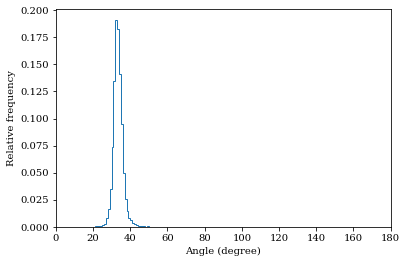

# DeepAngle
Fast calculation of contact angles in tomography images using deep learning

DeepAngle is a machine learning-based method to determine the contact angles of different phases in the tomography images of porous materials. Measurement of angles in 3-D needs to be done within the surface perpendicular to the angle planes, and it could become inaccurate when dealing with the discretized space of the image voxels. A computationally intensive solution is to correlate and vectorize all surfaces using an adaptable grid, and then measure the angles within the desired planes. On the contrary, the present study provides a rapid and low-cost technique powered by deep learning to estimate the interfacial angles directly from images. DeepAngle is tested on both synthetic and realistic images against direct measurement technique and found to improve the r-squared 5 to 16%, while lowering the computational cost 20 times. This rapid method is especially applicable for processing large tomography data and time-resolved images, which is computationally intensive.

Here, I have written some demos to calculate a few contact angles. 

## Demo #1 : Calculating the contact angle distribution from real data
In this example, the input data is recorded in an hdf file with the format of 16-bit signed integer and filed name of "/Map". Three phases are availible in the image, solid, fluid #1 and fluid #2. Solid is denoted by voxel values of 1, fluid #1 which is assumed to be the wetting phase or water is coded as voxel values of 0, and fluid #2 is coded with voxel values of 2. Any irrelevant pixel, such as background, is denoted by -1. 

```python
import deepangle as da
# Name of the hdf5 file containing the volumetric image (h5 filed name: /Map)
Data='Data/Data1.h5';
# Extracting contact angles and corresponding points 
Angles,Coordinates=da.getangle(Data)
# Plotting the angle distribution
da.hist(Angles)
# Exporting the results as a text file
da.saveresults(Angles,Coordinates,'Output1')
```

