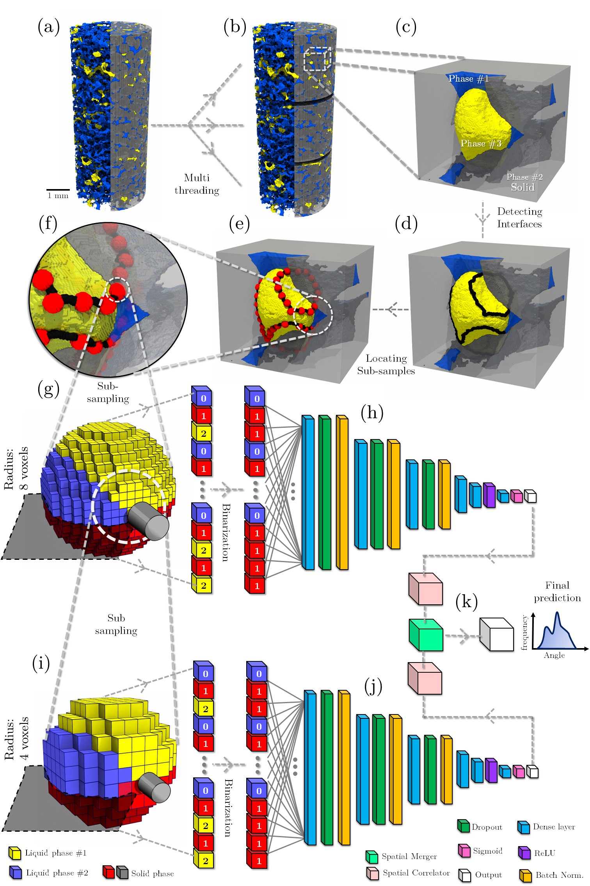
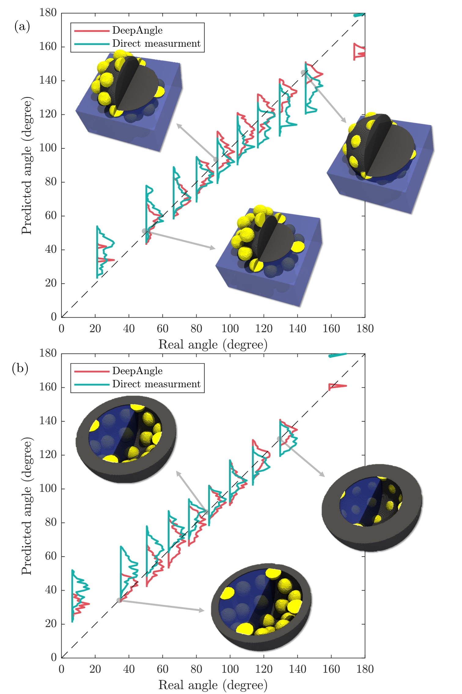
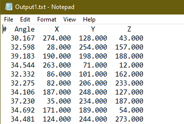
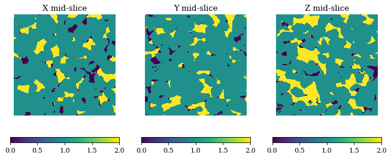

# DeepAngle
Fast calculation of contact angles in tomography images using deep learning

Paper on arXive: [Link](https://arxiv.org/abs/2211.15243).
Paper on Science Direct: [Link](https://www.sciencedirect.com/science/article/pii/S2949891023003949).

DeepAngle is a machine learning-based method to determine the contact angles of different phases in the tomography images of porous materials. Measurement of angles in 3-D needs to be done within the surface perpendicular to the angle planes, and it could become inaccurate when dealing with the discretized space of the image voxels. A computationally intensive solution is to correlate and vectorize all surfaces using an adaptable grid, and then measure the angles within the desired planes. On the contrary, the present study provides a rapid and low-cost technique powered by deep learning to estimate the interfacial angles directly from images. DeepAngle is tested on both synthetic and realistic images against direct measurement technique and found to improve the r-squared 5 to 16%, while lowering the computational cost 20 times. This rapid method is especially applicable for processing large tomography data and time-resolved images, which is computationally intensive.
This is the summary of the data flow from tomography images to contact angle prediction. 
<br><br>

<br>

## Accuracy? 
We have validated DeepAngle by comparing it with direct measurement tequnique to predict contact angles on convex and concave surfaces. Please refer to the linked [Paper](https://arxiv.org/abs/2211.15243) for more details. The raw volumetric images of this test are availible in this repository at "Data/Test/".
<br><br>

<br>

## How to use?
Here, I have written some demos to calculate a few contact angles. 

### Demo #1 : Calculating the contact angle distribution from real data
In this example, the input data is recorded in an hdf file with the format of 16-bit signed integer and filed name of "/Map". Three phases are availible in the image, solid, fluid #1 and fluid #2. Solid is denoted by voxel values of 1, fluid #1 which is assumed to be the wetting phase or water is coded as voxel values of 0, and fluid #2 is coded with voxel values of 2. If you are dealing with clyndrical images instead of a full cube, use -1 for pixels out side of the region of interest. 
In this example, the raw tomography data is sub-sampled from the data of this paper: [From connected pathway flow to ganglion dynamics by Rucker et al.].
```python
import deepangle as da
# Name of the hdf5 file containing the volumetric image (h5 field name: /Map)
Data='Data/Data1.h5';
# Extracting contact angles and corresponding points 
Angles,Coordinates=da.getangle(Data,Para=0)
# Plotting the angle distribution
da.hist(Angles)
# Exporting the results as a text file
da.saveresults(Angles,Coordinates,'Output1')

# Example for reading from Matlab file
Data='Data/Data2.mat';
Angles,Coordinates=da.getangle(Data,Para=0)
# Plotting the angle distribution
da.hist(Angles)
# Exporting the results as a text file
da.saveresults(Angles,Coordinates,'Output2')
```
and this the plotted distribution:
<br>

<br>
<br>
and this an example of the saved output file as txt:
<br>

<br>

### Demo #2 : Explicitly getting a 3D array as input

```python
import deepangle as da
import scipy.io as sio
# Reading a Matlab saved variable from the data directory that contains a variable called "A"
Data=sio.loadmat('Data/Data2.mat')  
Data=Data['A']
# Visulizing 3 mid-slices of the volumetric image
da.sliceshow(Data)
# Extracting contact angles and corresponding points by explicitly giving the numpy array as input
Angles,Coordinates=da.getangle(Data)
# Plotting the angle distribution
da.hist(Angles)
# Exporting the results as a text file
da.saveresults(Angles,Coordinates,'Output1')
```
and the sliceshow output would be:
<br><br>

<br>

## How to install? 
Simply download/clone the github repository and start importing the deepangle.py functions as in Demo#1. Make sure to have these python packages installed:
* tensorflow
* joblib
* tqdm
* edt
* h5py
* sklearn
* scipy
* numpy
* matplotlib


## Citation
Please consider citing this paper if you are using DeepAngle in your research: 
[DeepAngle: Fast calculation of contact angles in tomography images using deep learning, Arash Rabbani and Chenhao Sun and Masoud Babaei and Vahid J. Niasar and Ryan T. Armstrong and Peyman Mostaghimi, arXiv 2211.15243 (2022).]

